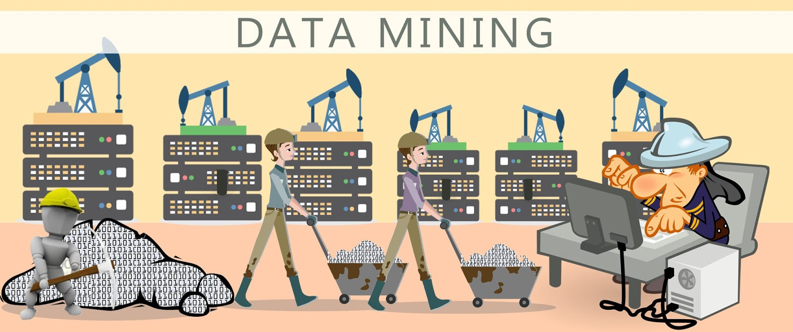

# Mining of Massive Datasets
Jure Leskovec, Anand Rajaraman and Jeff Ullman welcome you to the self-paced version of the on-line course based on the book Mining of Massive Datasets. It is intended for people who have a reasonable undergraduate education in Computer Science, including courses in data structures, algorithms, databases, calculus, statistics, and linear algebra.

In this course, you will learn many of the interesting algorithms that have been developed for efficient processing of large amounts of data in order to extract simple and useful models of that data.  These techniques are often used to predict properties of future instances of the same sort of data, or simply to make sense of the data already available.  Many people view data mining, or "big data" as machine learning.  There are indeed some techniques for processing large datasets that can be considered machine learning, and we shall cover a number of these.  But there are also many algorithms and ideas for dealing with big data that are not usually classified as machine learning, and we shall cover many of these as well.

## Course Outline
The course is divided into 15 modules of videos and homeworks and a final exam. In the synchronous version of the course, the material is intended to be covered in seven weeks. However, you are free to spend more or less time learning this material. Here is a list of the 15 modules:

1. MapReduce
2. Link Analysis (PageRank)
3. Locality-Sensitive Hashing
4. Distance Measures and Nearest-Neighbor Learning
5. Frequent Itemset Analysis
6. Social-Network Graphs
7. Algorithms for Data Streams
8. Recommendation Systems
9. Dimensionality Reduction
10. Clustering
11. Computational Advertising
12. Machine Learning
13. More on MapReduce Algorithms
14. More on Locality-Sensitive Hashing
15. More on Link Analysis

## Course Materials
The material found in this course is supported by a free on-line book, with the same title and authors as the course itself. The book is published by Cambridge University Press, but, by courtesy of the publisher, you can download a free copy at [www.mmds.org](http://www.mmds.org/). In addition to the videos provided, the slide sets used in each video can be accessed via the "Handouts" link beneath each video.
